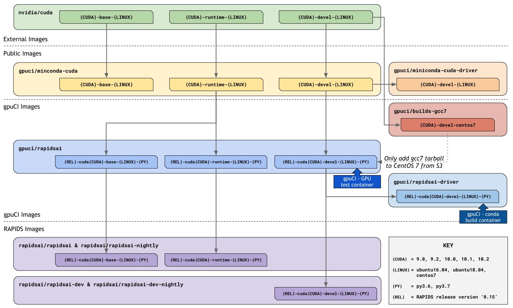

# gpuci-build-environment

## Overview

This repo contains Docker images used by gpuCI and release images for RAPIDS.
Additional gpuCI users also have custom images in this repo.

Below is a flow diagram of how the major gpuCI images relate to each other.
Arrows between images imply that the source image is the `FROM` image for the
destination image.

### Image Flow Diagram



## Public Images

The `gpuci/miniconda-cuda` image is the base layer that all gpuCI testing and
RAPIDS release containers are built off of. This image also serves as a public
image for those who want a one-to-one compatible `nvidia/cuda` image with
`miniconda` installed. Below is a description of the image and how it is built.

<!-- TODO update build status icons -->
[`gpuci/miniconda-cuda`](https://hub.docker.com/r/gpuci/miniconda-cuda/tags)
    [](https://gpuci.gpuopenanalytics.com/view/gpuCI%20docker-builds/job/docker/job/dockerhub-gpuci/job/gpuci-miniconda-cuda/)

- Dockerfiles
  - Ubuntu 16.04 & 18.04 - [`Dockerfile`](miniconda-cuda/Dockerfile)
  - CentOS 7 - [`Dockerfile.centos7`](miniconda-cuda/Dockerfile.centos7)
- Base image
  - `FROM nvidia/cuda:${CUDA_VER}-{$CUDA_TYPE}-${LINUX_VER}`
- Purpose
  - Contains CUDA + miniconda installed
  - Replaces `nvidia/cuda` and enables conda environment
  - Activates the `base` conda environment on launch
  - Serves as a base image for community using `conda` and gpuCI users to
  build their own custom image
- Tags - `${CUDA_VER}-${CUDA_TYPE}-${LINUX_VER}`
  - Supports these options
    - `${CUDA_VER}` - `9.0`, `9.2`, `10.0`, `10.1`, `10.2`
    - `${CUDA_TYPE}` - `base`, `runtime`, `devel`
    - `${LINUX_VER}` - `ubuntu16.04`, `ubuntu18.04`, `centos7`

## gpuCI Images

The images below are used for `conda` builds and GPU tests in gpuCI, see the
[diagram](#image-flow-diagram) above for more context. They are ordered by their
dependencies.

### Supporting Image - `gcc7` From-Source Build for CentOS 7

A supplemental image that is sourced for CentOS 7 images is `gpuci/builds-gcc7`.
This is due to `gcc4` being the standard `gcc` in CentOS 7. With this image we
pre-build `gcc7.3` and then use the following to pull the pre-built files into
an image:

```
# Install gcc7 from prebuilt image
COPY --from=gpuci/builds-gcc7:10.0-devel-centos7 /usr/local/gcc7 /usr/local/gcc7
```
<!-- TODO update build status icons -->
[`gpuci/builds-gcc7`](https://hub.docker.com/r/gpuci/builds-gcc7/tags)
    [](https://gpuci.gpuopenanalytics.com/view/gpuCI%20docker-builds/job/docker/job/dockerhub-gpuci/job/gpuci-builds-gcc7/)

- Dockerfile
  - [`Dockerfile.centos7`](builds-gcc7/Dockerfile.centos7)
- Base Image
  - `FROM nvidia/cuda:${CUDA_VER}-${CUDA_TYPE}-${LINUX_VER}`
- Purpose
  - Builds gcc7 from source on CentOS 7
  - Used by CentOS 7 images during `gpuci/miniconda-cuda` build to install gcc7 without building
- Tags - `${CUDA_VER}-${CUDA_TYPE}-${LINUX_VER}`
  - Supports these options
    - `${CUDA_VER}` - `10.0`, `10.1`, `10.2`
    - `${CUDA_TYPE}` - `devel`
    - `${LINUX_VER}` - `centos7`

### GPU Test Images

The `gpuci/rapidsai` and `gpuci/rapidsai-nightly` images serve different
purposes based on their `CUDA_TYPE` and their repo location:

- `CUDA_TYPE`
  - `devel` - image types are used in gpuCI on nodes with [NVIDIA Container Toolkit](https://github.com/NVIDIA/nvidia-docker)
installed for running tests with GPUs. They are also used by the RAPIDS `devel`
release images and as the base for `gpuci/rapidsai-driver` and `gpuci/rapidsai-driver-nightly`.
  - `runtime` - image types are used by RAPIDS `base` and `runtime` release.
  RAPIDS `base` images do not use the `base` type from `gpuci/miniconda-cuda` or
  `nvidia/cuda` as they do not have all the required files to run RAPIDS.
- Repo locations
  - `gpuci/rapidsai` - tracks the **stable** version of the [integration](https://github.com/rapidsai/integration/tree/branch-0.14/conda/recipes) `env` packages
  - `gpuci/rapidsai-nightly` - tracks the **nightly** version of the [integration](https://github.com/rapidsai/integration/tree/branch-0.14/conda/recipes) `env` packages
<!-- TODO update build status icons -->
[`gpuci/rapidsai`](https://hub.docker.com/r/gpuci/rapidsai/tags) or [`gpuci/rapidsai-nightly`](https://hub.docker.com/r/gpuci/rapidsai-nightly/tags) [](https://gpuci.gpuopenanalytics.com/view/gpuCI%20docker-builds/job/docker/job/dockerhub-gpuci/job/rapidsai-base/)

- Dockerfiles
  - `base` & `runtime`:
    - Ubuntu 16.04 & 18.04 - [`Dockerfile`](gpuci/rapidsai/base-runtime/Dockerfile)
    - CentOS 7 - [`Dockerfile.centos7`](gpuci/rapidsai/base-runtime/Dockerfile.centos7)
  - `devel`:
    - Ubuntu 16.04 & 18.04 - [`Dockerfile`](gpuci/rapidsai/devel/Dockerfile)
    - CentOS 7 - [`Dockerfile.centos7`](gpuci/rapidsai/devel/Dockerfile.centos7)
- Build arguments
  - `RAPIDS_CHANNEL` - `conda` channel to use for install of integration pkgs
    - `rapidsai` for stable; `rapidsai-nightly` for nightly
  - `RAPIDS_VER` - Major and minor version to use for packages (e.g. `0.14`)
- Base image
  - `FROM gpuci/miniconda-cuda:${CUDA_VER}-${CUDA_TYPE}-${LINUX_VER}`
- Purpose
  - Provide a common testing base that can be reused by the RAPIDS release images
  - Use the [integration](https://github.com/rapidsai/integration/tree/branch-0.14/conda/recipes) `env` packages to pull consistent versioning information for all of RAPIDS
    - **NOTE**: These images install the `env` packages to get their
    dependencies, but are **removed** after install in this container. This
    allows the same packages to be installed again later updating the image. It
    also allows PR jobs to use the `devel` image and override dependencies for
    testing purposes. With the `env` packages still installed there would be a
    `conda` solve conflict.
- Tags - `${CUDA_VER}-${CUDA_TYPE}-${LINUX_VER}-py${PYTHON_VER}`
  - Supports these options
    - `${CUDA_VER}` - `10.0`, `10.1`, `10.2`
    - `${CUDA_TYPE}` - `base`, `runtime`, `devel`
    - `${LINUX_VER}` - `ubuntu16.04`, `ubuntu18.04`, `centos7`
    - `${PYTHON_VER}` - `3.6`, `3.7`

#### `conda` Build Images

The `gpuci/rapidsai-driver` and `gpuci/rapidsai-driver-nightly` images are used
to build `conda` packages on CPU-only machines. They are from the `devel`
images of `gpuci/rapidsai` and `gpuci/rapidsai-nightly`. To enable some of the
RAPIDS builds on CPU-only machines we leverage this container by force
installing the NVIDIA drivers. This allows us to have the necessary files for
linking during the build steps.

As with `gpuci/rapidsai` there are regular and `nightly` repo locations:

- `gpuci/rapidsai-driver` - tracks the **stable** version of the [integration](https://github.com/rapidsai/integration/tree/branch-0.14/conda/recipes) `env` packages
- `gpuci/rapidsai-driver-nightly` - tracks the **nightly** version of the [integration](https://github.com/rapidsai/integration/tree/branch-0.14/conda/recipes) `env` packages
<!-- TODO update build status icons -->
[`gpuci/rapidsai-driver`](https://hub.docker.com/r/gpuci/rapidsai-base-driver/tags) & [`gpuci/rapidsai-driver-nightly`](https://hub.docker.com/r/gpuci/rapidsai-base-driver/tags)
    [](https://gpuci.gpuopenanalytics.com/view/gpuCI%20docker-builds/job/docker/job/dockerhub-gpuci/job/rapidsai-base-driver/)

- Dockerfile
  - Ubuntu 18.04 - [`Dockerfile`](rapidsai-driver/Dockerfile)
- Build arguments
  - `DRIVER_VER` = NVIDIA driver version to install (i.e. `396.44-1`)
- Base image
  - `FROM gpuci/rapidsai:${CUDA_VER}-devel-ubuntu18.04-py${PYTHON_VERSION}`
- Purpose
  - Installs the NVIDIA driver/libcuda to enable conda builds on CPU-only machines
  - Built for conda builds and only contains the driver install command
  - Maintained as a way to remove the `apt-get install` overhead that can slow the testing/build process
- Tags - `${CUDA_VER}-devel-ubuntu18.04-py${PYTHON_VER}`
  - Supports these options
    - `${CUDA_VER}` - `10.0`, `10.1`, `10.2`
    - `${PYTHON_VER}` - `3.6`, `3.7`

## RAPIDS Images

The RAPIDS release images are based off of the `gpuci/rapidsai` images for
*stable/release* images and based off of the `gpuci/rapidsai-nightly` images for
*nightly* images. Scripts and templates for these images are maintained in the
[build](https://github.com/rapidsai/build) repo.

For a list of available images see the RAPIDS [build README](https://github.com/rapidsai/build#image-types).
